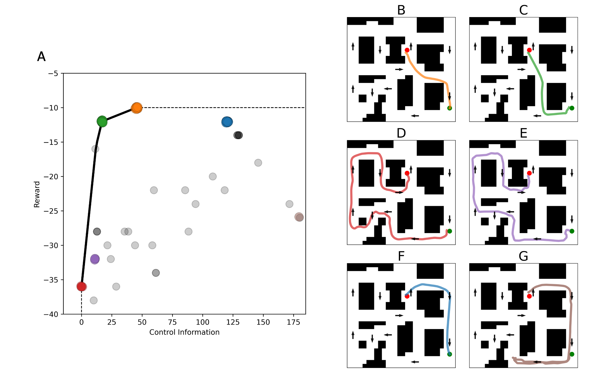
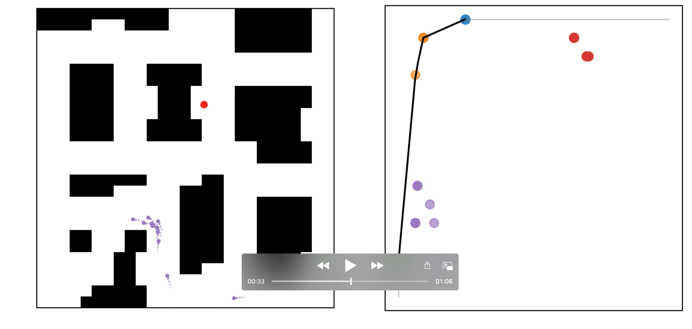

# Humans account for cognitive costs when finding shortcuts : An information-theoretic analysis of navigation
 

This repository is the official implementation of [Humans account for cognitive costs when finding shortcuts: An information-theoretic analysis of navigation](https://www.biorxiv.org/content/10.1101/2022.08.06.503020v1.article-info).

To generate the figures in the paper, you can follow the numbered notebooks in the notebooks folder. The notebooks are numbered in the order they should be run. The notebooks are written in Python 3.8 and require the packages listed in requirements.txt. 

In order to run the notebooks you will need to [download the data](https://osf.io/ykxts/) from the paper [Instructions matter: Individual differences in navigation strategy and ability](https://link.springer.com/article/10.3758/s13421-019-00941-5), then you can add the Experiment2 folder to the data folder of this project.

